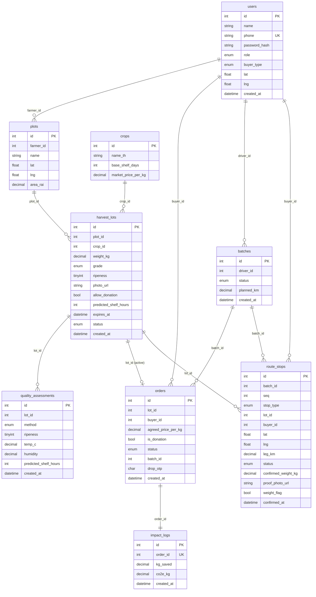

# ERD

ความสัมพันธ์เป็นเชิงตรรกะในแอป ไม่มี FOREIGN KEY และไม่มี VIEW ในฐานข้อมูล คอลัมน์ที่อ้างอิงตารางอื่นมี INDEX

```mermaid
erDiagram
  users ||--o{ plots : farmer_id
  plots ||--o{ harvest_lots : plot_id
  crops ||--o{ harvest_lots : crop_id
  harvest_lots ||--o{ quality_assessments : lot_id
  harvest_lots ||--o| orders : "lot_id (active)"
  users ||--o{ orders : buyer_id
  batches ||--o{ orders : batch_id
  users ||--o{ batches : driver_id
  batches ||--o{ route_stops : batch_id
  harvest_lots ||--o{ route_stops : lot_id
  users ||--o{ route_stops : buyer_id
  orders ||--|| impact_logs : order_id

  users {
    int id PK
    string name
    string phone UK
    string password_hash
    enum role
    enum buyer_type
    float lat
    float lng
    datetime created_at
  }

  crops {
    int id PK
    string name_th
    int base_shelf_days
    decimal market_price_per_kg
  }

  plots {
    int id PK
    int farmer_id
    string name
    float lat
    float lng
    decimal area_rai
  }

  harvest_lots {
    int id PK
    int plot_id
    int crop_id
    decimal weight_kg
    enum grade
    tinyint ripeness
    string photo_url
    bool allow_donation
    int predicted_shelf_hours
    datetime expires_at
    enum status
    datetime created_at
  }

  quality_assessments {
    int id PK
    int lot_id
    enum method
    tinyint ripeness
    decimal temp_c
    decimal humidity
    int predicted_shelf_hours
    datetime created_at
  }

  orders {
    int id PK
    int lot_id
    int buyer_id
    decimal agreed_price_per_kg
    bool is_donation
    enum status
    int batch_id
    char drop_otp
    datetime created_at
  }

  batches {
    int id PK
    int driver_id
    enum status
    decimal planned_km
    datetime created_at
  }

  route_stops {
    int id PK
    int batch_id
    int seq
    enum stop_type
    int lot_id
    int buyer_id
    float lat
    float lng
    decimal leg_km
    enum status
    decimal confirmed_weight_kg
    string proof_photo_url
    bool weight_flag
    datetime confirmed_at
  }

  impact_logs {
    int id PK
    int order_id UK
    decimal kg_saved
    decimal co2e_kg
    datetime created_at
  }
```
