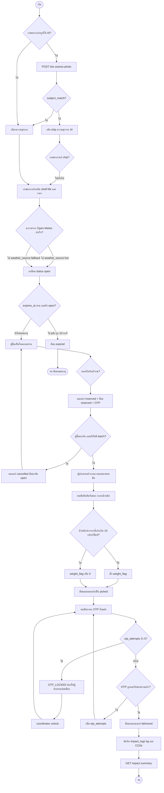
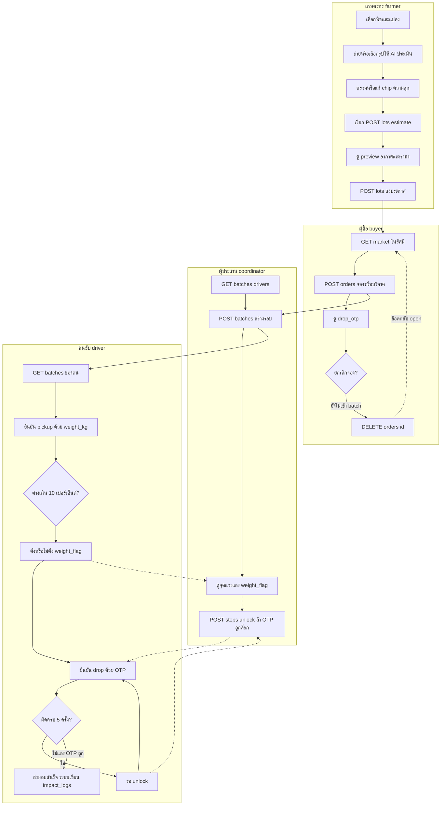

# กระบวนการธุรกิจ (Business Flow)

อ้างอิง flow จริงจาก `orders.ts`, `lots.ts`, `ai/vision.ts`, `createBatch.ts`, `confirmStop.ts`, `expireLots.ts`, `openMeteo.ts`, `impactSummary.ts`

## Flowchart ภาพรวม

## Swimlane 4 lane

## ทางแยกสำคัญ (อ้างโค้ด)

| ทางแยก | พฤติกรรมจริง | ไฟล์ |
|---|---|---|
| AI ประเมินความสุก | `POST /lots/assess-photo`; ถ้า `subject_match` เป็น false ไม่ใช้ค่าความสุก; confidence ต่ำกว่า 0.6 ตั้ง `low_confidence` | `vision.ts`, `lots.ts`, `farmer.tsx` |
| อากาศ fallback / พยากรณ์ | เฉลี่ยกลางวัน 10–17 จากพยากรณ์ 72 ชม.; ไม่สำเร็จภายใน 3 วินาที → 32°C / 75% และ `weather_source = fallback` | `openMeteo.ts`, `lots.ts` |
| ความชื้นสูงกว่า 85% | คูณอายุที่คำนวณได้ด้วย 0.9 | `shelfLife.ts` |
| ล็อตหมดอายุ | เฉพาะสถานะ `open` ที่ `expires_at <= now` ถูกตั้งเป็น `expired` ทุก 10 นาที; ล็อต `reserved` ไม่ถูก expire | `expireLots.ts` |
| ยกเลิกการจอง | ได้เมื่อออเดอร์ยัง `reserved` และ `batch_id` เป็น null; ออเดอร์ → `cancelled`, ล็อต → `open` | `orders.ts` |
| จองซ้อน | `SELECT ... FOR UPDATE` บนล็อต; ถ้าไม่ใช่ `open` ตอบ 409 `LOT_NOT_OPEN` | `orders.ts` |
| น้ำหนักต่างเกิน 10% | `abs(ชั่งได้ - ที่แจ้ง) / ที่แจ้ง > 0.1` → `weight_flag = 1` แต่ยังยืนยันรับของได้ | `confirmStop.ts` |
| OTP ผิดครบ 5 ครั้ง | `otp_attempts >= 5` → 409 `OTP_LOCKED`; ผู้ประสาน `POST /stops/:id/unlock` รีเซ็ตเป็น 0 | `confirmStop.ts`, `stops.ts` |
| Drop ก่อน pickup | ถ้ายังมีออเดอร์ในจุดส่งเป็น `reserved` → 409 `PICKUP_REQUIRED` | `confirmStop.ts` |
| บันทึก impact | ตอน drop สำเร็จ: `kg_saved` = น้ำหนักที่ยืนยันตอน pickup, `co2e_kg = kg_saved * 2.5` | `confirmStop.ts`, `seedData.ts` |
