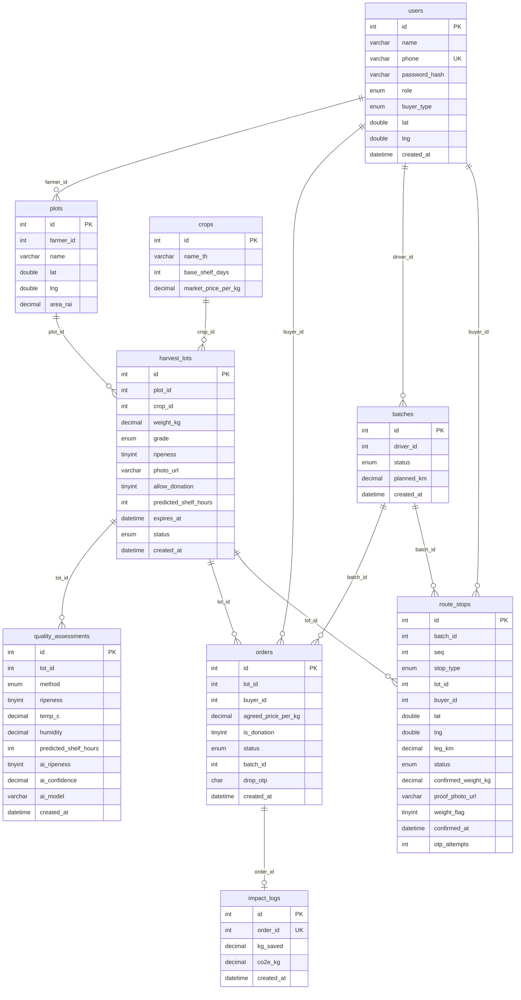

# ERD

สคีมาจาก `server/src/db/migrations/001_init.sql` และ `002_otp_attempts.sql`  
ความสัมพันธ์ด้านล่างเป็น**เชิงตรรกะในแอป** ไม่มี `FOREIGN KEY` / `REFERENCES` ใน SQL

คอลัมน์ `otp_attempts` ถูกเพิ่มใน migration `002_otp_attempts.sql`  
คอลัมน์ `ai_ripeness`, `ai_confidence`, `ai_model` ถูกเพิ่มใน migration `003_ai_assessment.sql`

## ทำไมไม่มี FOREIGN KEY constraint

จาก `docs/IMPLEMENTATION_PLAN.md` ข้อจำกัดของวิชา:

> ห้ามใช้ FOREIGN KEY constraint และ VIEW ในฐานข้อมูล (เซิร์ฟเวอร์ของวิชาไม่ให้สิทธิ์ REFERENCES / CREATE VIEW)

ดังนั้น migration ใส่เฉพาะ **PRIMARY KEY / UNIQUE / INDEX** บนคอลัมน์ที่อ้างอิงตารางอื่น เช่น `idx_plots_farmer_id`, `idx_orders_lot_id`, `uq_impact_logs_order_id`

## บังคับ integrity ใน service แทน

| กฎเชิงตรรกะ | บังคับที่ |
|---|---|
| แปลงต้องเป็นของเกษตรกรที่ login | `lots.ts` / `plots.ts` ตรวจ `farmer_id` |
| จองได้เฉพาะล็อต `open` ที่ยังไม่หมดอายุ | `orders.ts` + `SELECT ... FOR UPDATE` |
| ออเดอร์ผูกคนซื้อที่ login | `orders.ts` ตรวจ `buyer_id` |
| คนขับยืนยันได้เฉพาะรอบของตน | `confirmStop.ts`, `batches.ts` เทียบ `driver_id` |
| สถานะล็อตเปลี่ยนได้เฉพาะคู่ที่อนุญาต | `assertLotTransition` |
| หนึ่งออเดอร์มี impact ได้ครั้งเดียว | `UNIQUE (order_id)` บน `impact_logs` |
| คนขับ/พิกัดผู้ซื้อต้องมีก่อนสร้างรอบ | `createBatch.ts` ตรวจ role และ lat/lng |

ตาราง `schema_migrations` ถูกสร้างโดย `migrate.ts` เพื่อจำไฟล์ migration ที่รันแล้ว ไม่ได้อยู่ในไฟล์ `.sql` ของชุดนี้ จึงไม่ใส่ในแผนภาพด้านบน
