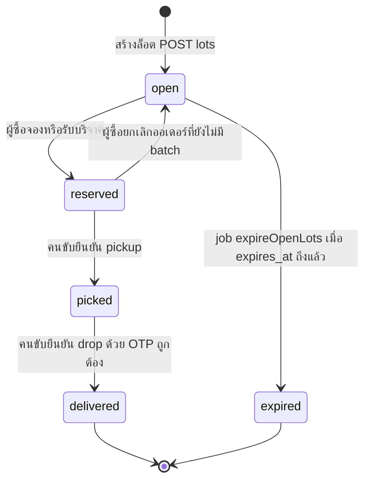
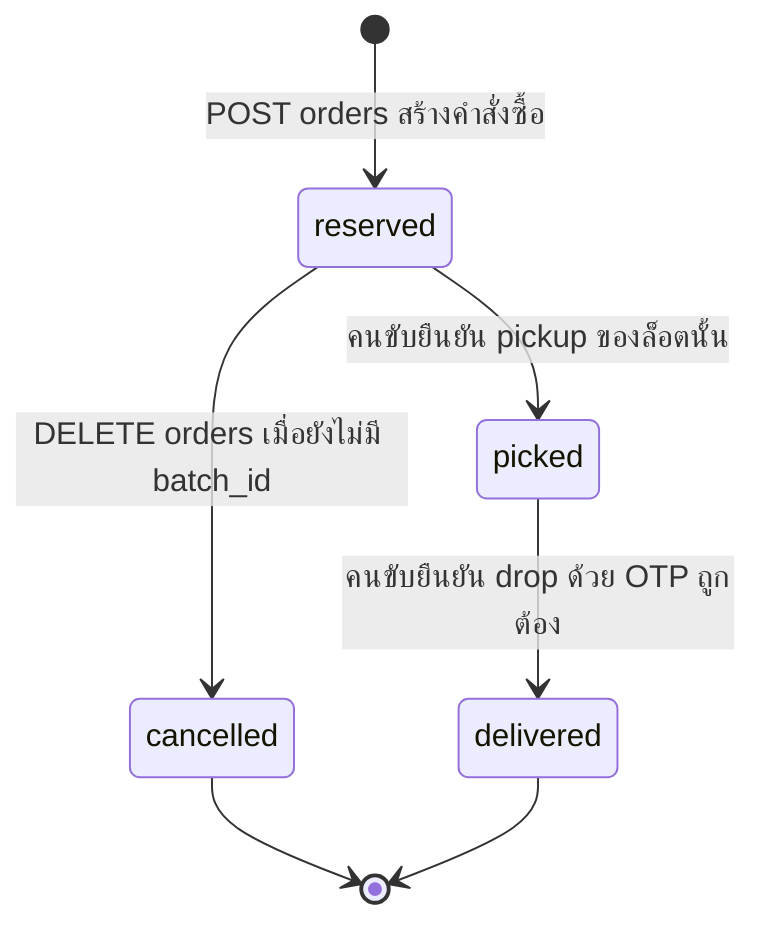

# แผนภาพสถานะ (State Diagram)

## ล็อต (`harvest_lots.status`)

นิยามสถานะและ transition ที่อนุญาตอยู่ใน `server/src/domain/lotStateMachine.ts` เท่านั้น  
ฟังก์ชัน `assertLotTransition(from, to)` จะโยน `InvalidLotTransitionError` ถ้าไม่อยู่ในรายการด้านล่าง

สถานะใน type/ENUM: `open | reserved | picked | delivered | expired | cancelled`

> หมายเหตุจากโค้ด: มีค่า `cancelled` ใน ENUM และ type แต่**ไม่มี transition ใดใน `TRANSITIONS` ที่ไปหรือจาก `cancelled`**  
> เมื่อผู้ซื้อยกเลิกออเดอร์ ล็อตกลับเป็น `open` (เส้น `reserved → open`) ไม่ได้ตั้งล็อตเป็น `cancelled`

### ตาราง transition ที่อนุญาต (คัดจากโค้ด)

| จาก | ไป | เหตุการณ์ในระบบ |
|---|---|---|
| open | reserved | `POST /api/orders` |
| reserved | picked | `POST /api/stops/:id/confirm` แบบ pickup |
| picked | delivered | `POST /api/stops/:id/confirm` แบบ drop สำเร็จ |
| open | expired | `expireOpenLots` |
| reserved | open | `DELETE /api/orders/:id` |

## ออเดอร์ (`orders.status`)

ไม่มีโมดูล state machine แยกสำหรับออเดอร์ สถานะถูกเปลี่ยนใน service ดังนี้

ENUM: `reserved | picked | delivered | cancelled`

| จาก | ไป | เงื่อนไขจากโค้ด |
|---|---|---|
| — | reserved | จองสำเร็จ; สร้าง `drop_otp` 4 หลัก |
| reserved | cancelled | เจ้าของออเดอร์ยกเลิก และ `batch_id IS NULL` มิฉะนั้น 409 |
| reserved | picked | pickup ของล็อตในรอบนั้น |
| picked | delivered | drop สำเร็จและเขียน `impact_logs` |

ออเดอร์ที่ถูกผูก `batch_id` แล้วยกเลิกไม่ได้ (`ORDER_IN_BATCH`)
