# แผนภาพความสัมพันธ์ของฐานข้อมูล (ER Diagram) — Agri-Rescue

แผนภาพนี้แสดงตารางทั้งหมด 26 ตารางในระบบ Agri-Rescue และความสัมพันธ์ระหว่างตาราง
(1 ต่อกลาง / 1 ต่อหลาย) ตาม FOREIGN KEY ที่กำหนดไว้ใน
[`schema_with_fk.sql`](./schema_with_fk.sql) โดยยึดหลัก: `users` เป็นตารางศูนย์กลางของระบบ
บทบาทผู้ใช้ (เกษตรกร/ผู้ซื้อ/คนขับ/ผู้ประสานงาน), `crops`/`crop_categories` เป็นแค็ตตาล็อก
พืชผลกลาง, `plots` → `harvest_lots` คือสายการเก็บเกี่ยว, `orders` → `batches`/`route_stops`
คือสายการซื้อขายและขนส่ง, และตารางที่เหลือเป็นข้อมูลประกอบ (log, การแจ้งเตือน, ตั๋วคำร้อง)

```mermaid
erDiagram
    users ||--o| buyer_profiles : "1 ผู้ใช้ มี 1 โปรไฟล์ผู้ซื้อ (ถ้า can_buy)"
    users ||--o| shops : "1 ผู้ใช้ มี 1 ร้านค้า (ถ้าเป็นผู้ขาย)"
    users ||--o{ org_application_docs : "ยื่นเอกสารสมัครองค์กร"
    users ||--o{ org_review_logs : "เป็นผู้สมัคร (user_id)"
    users ||--o{ org_review_logs : "เป็นแอดมินผู้ตรวจ (admin_id)"
    users ||--o{ crops : "เพิ่มพืชผลใหม่ (created_by)"
    users ||--o{ plots : "เป็นเจ้าของแปลง (farmer_id)"
    users ||--o{ lot_edit_logs : "เป็นผู้แก้ไขล็อต (editor_id)"
    users ||--o{ lot_delete_logs : "เป็นเจ้าของล็อตที่ถูกลบ (farmer_id)"
    users ||--o{ batches : "เป็นคนขับ (driver_id)"
    users ||--o{ orders : "เป็นผู้ซื้อ (buyer_id)"
    users ||--o{ route_stops : "เป็นผู้ซื้อที่จุดแวะส่ง (buyer_id)"
    users ||--o{ donation_infractions : "ทำผิดเงื่อนไขบริจาค"
    users ||--o{ shop_follows : "ติดตามร้านค้า"
    users ||--o{ notifications : "ได้รับการแจ้งเตือน"
    users ||--o{ support_tickets : "เปิดตั๋วคำร้อง"

    crop_categories ||--o{ crops : "จัดหมวดหมู่พืชผล"

    crops ||--o{ crop_reference_prices : "มีราคาอ้างอิงรายวัน"
    crops ||--o{ crop_season_factors : "มีตัวคูณราคาตามฤดูกาล"
    crops ||--o{ dit_mapping_suggestions : "มีข้อเสนอจับคู่รหัส DIT"
    crops ||--o{ harvest_lots : "ถูกเก็บเกี่ยวเป็นล็อต"

    plots ||--o{ harvest_lots : "เป็นแปลงต้นทางของล็อต"

    harvest_lots ||--o{ lot_photos : "มีรูปภาพประกอบ"
    harvest_lots ||--o{ lot_edit_logs : "มีประวัติการแก้ไข"
    harvest_lots ||--o{ quality_assessments : "มีผลประเมินคุณภาพ"
    harvest_lots ||--o{ orders : "ถูกสั่งซื้อ/รับบริจาค"
    harvest_lots ||--o{ route_stops : "เป็นจุดรับของ (pickup)"

    batches ||--o{ route_stops : "ประกอบด้วยจุดแวะ"
    batches ||--o{ orders : "ขนส่งคำสั่งซื้อ (batch_id)"

    orders ||--o| payments : "มีรายการชำระเงินจำลอง 1 ชุด (ไม่ใช่ออเดอร์บริจาค)"
    orders ||--o| donation_proofs : "มีหลักฐานการบริจาค 1 ชุด"
    orders ||--o{ donation_infractions : "มีประวัติการทำผิดเงื่อนไข"
    orders ||--o| impact_logs : "มีบันทึกผลกระทบ 1 ชุด"
    orders ||--o{ support_tickets : "ถูกอ้างอิงในตั๋วคำร้อง"

    shops ||--o{ shop_follows : "ถูกติดตามโดยผู้ใช้"

    support_tickets ||--o{ support_messages : "มีข้อความสนทนา"
    support_tickets ||--o{ support_attachments : "มีไฟล์แนบ"
    support_messages ||--o{ support_attachments : "มีไฟล์แนบต่อข้อความ"

    users {
        int id PK
        varchar name
        varchar phone UK
        varchar email UK
        enum role "farmer/buyer/driver/coordinator"
        tinyint can_sell
        tinyint can_buy
        tinyint is_admin
    }

    buyer_profiles {
        int user_id PK,FK
        enum buyer_type
        enum donor_tier
        enum org_status
    }

    org_application_docs {
        int id PK
        int user_id FK
        varchar stored_name
        enum doc_category
    }

    org_review_logs {
        int id PK
        int user_id FK
        int admin_id FK
        enum action
    }

    crop_categories {
        int id PK
        varchar name_th
        varchar name_en
        int default_shelf_days
    }

    crops {
        int id PK
        varchar name_th
        int category_id FK
        int created_by FK
        decimal market_price_per_kg
        enum status
    }

    crop_reference_prices {
        int id PK
        int crop_id FK
        date date
        decimal wholesale_price
    }

    crop_season_factors {
        int id PK
        int crop_id FK
        tinyint month
        decimal factor
    }

    dit_mapping_suggestions {
        int id PK
        int crop_id FK
        varchar product_code
        enum status
    }

    plots {
        int id PK
        int farmer_id FK
        varchar name
        double lat
        double lng
    }

    harvest_lots {
        int id PK
        int plot_id FK
        int crop_id FK
        decimal weight_kg
        enum grade
        enum sale_mode
        enum status
        datetime expires_at
    }

    lot_photos {
        int id PK
        int lot_id FK
        varchar path
    }

    lot_edit_logs {
        int id PK
        int lot_id FK
        int editor_id FK
        varchar field_name
    }

    lot_delete_logs {
        int id PK
        int lot_id "ไม่มี FK (ดูหมายเหตุใน schema)"
        int farmer_id FK
        json snapshot_json
    }

    quality_assessments {
        int id PK
        int lot_id FK
        enum method
        tinyint ripeness
    }

    batches {
        int id PK
        int driver_id FK
        enum status
        decimal planned_km
    }

    orders {
        int id PK
        int lot_id FK
        int buyer_id FK
        int batch_id FK
        decimal quantity_kg
        tinyint is_donation
        enum status
        char drop_otp
    }

    route_stops {
        int id PK
        int batch_id FK
        int lot_id FK
        int buyer_id FK
        enum stop_type
        enum status
    }

    payments {
        int id PK
        int order_id FK,UK
        decimal amount
        enum status
        varchar provider
        datetime deadline_at
        datetime paid_at
    }

    donation_proofs {
        int id PK
        int order_id FK,UK
        enum status
        datetime due_at
    }

    donation_infractions {
        int id PK
        int user_id FK
        int order_id FK
        enum reason
    }

    impact_logs {
        int id PK
        int order_id FK,UK
        decimal kg_saved
        decimal co2e_kg
    }

    shops {
        int user_id PK,FK
        varchar name
    }

    shop_follows {
        int user_id PK,FK
        int shop_id PK,FK
    }

    notifications {
        int id PK
        int user_id FK
        varchar type
        varchar title_key
    }

    support_tickets {
        int id PK
        int user_id FK
        int order_id FK
        enum topic
        enum status
    }

    support_messages {
        int id PK
        int ticket_id FK
        enum sender_role
        varchar body
    }

    support_attachments {
        int id PK
        int ticket_id FK
        int message_id FK
        varchar stored_name
    }
```

